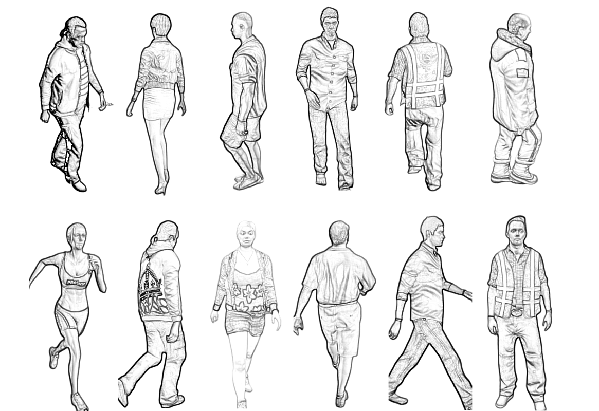
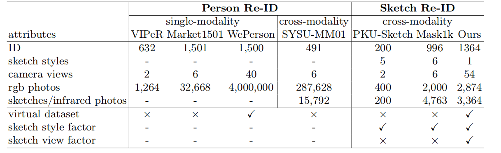
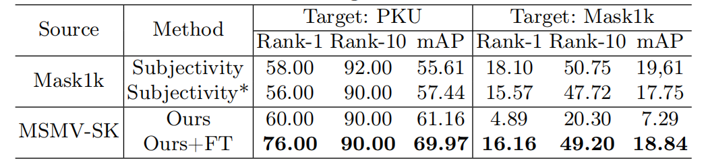

# MSMV-SK
This repository contains the MSMV-SK dataset proposed in our paper "Style Separation and Content Recovery for Generalizable Sketch Re-identification and A New Benchmark".

Fig. 1. Sample images from the proposed dataset.

## Table of Contents
- [Dataset Description](#dataset-description)
- [Experiment results](#experiment-results)
- [Contacts](#contacts)

## Dataset Description

In this paper, we collect a new challenging multi-source synthetic sketch-photo person re-identification dataset called the MSMV-SK dataset. The MSMV-SK dataset is constructed based on four public datasets VIPeR, Market1501, SYSU-MM01, and WePerson. We randomly select identities from these datasets as a reference subset, and the corresponding photos constitute the photo part of the MSMV-SK dataset, with the specific information shown in Table 1.

Table 1. Comparisons between related datasets and the created MSMV-SK.
 

### Download Link
Download link for the full dataset will be released soon.

## Experiment Results
To prove the effectiveness of the proposed framework on cross-domain generalization learning, we select a dataset from Mask1k and MSMV-SK datasets as the training set, and use PKU and Mask1k as the testing set. We evaluate the effectiveness of the proposed method by comparing it with the state-of-the-art methods in Table 2. 

Table 2. Performance comparison with the state-of-the-art methods on the DG Re-ID setting. "*" indicates that we re-implement this work based on the authors’ code and FT indicates fine-tuning. 
 

## Contacts

Lu Lingyi

School of Computer Science and Technology, Wuhan University of Science and Technology

lly@wust.edu.cn
